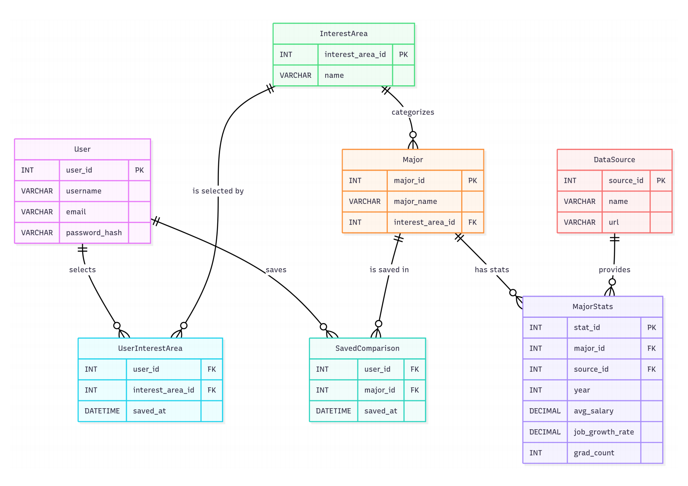

# Database Design Document

## 1\. ER Diagram



-----

## 2\. Design Rationale and Assumptions

*In designing this database, our guiding principle was that any concept with its own distinct attributes that is referenced multiple times should be its own table. This approach ensures data integrity and reduces redundancy, aligning with the principles of database normalization.*

### **User**

The `User` entity stores credentials and account information. It's the core entity for tracking user activity, such as which majors they choose to save for comparison.

  * **Relationships**: A `User` can save many `Major`s, and a `Major` can be saved by many `User`s. This many-to-many relationship is resolved through the `SavedComparison` junction table. A user can also select many `InterestArea`s through the `UserInterestArea` table.

### **InterestArea**

The `InterestArea` entity acts as a lookup table for categories, preventing the need to repeat text values within the `Major` table. This is used to filter majors by subject area.

  * **Relationships**: An `InterestArea` can categorize many `Major`s in a one-to-many relationship. Each `Major` belongs to just one `InterestArea`.

### **UserInterestArea**

This is a **junction table** that resolves the many-to-many relationship between `User` and `InterestArea`, allowing a user to follow or select multiple areas of interest.

  * **Relationships**: It links one `User` to one `InterestArea` per row, storing a timestamp of when the selection was made.

### **Major**

The `Major` entity stores the details for each academic major, such as its name and description.

  * **Relationships**: It has a many-to-one relationship with `InterestArea` and a one-to-many relationship with `MajorStatistic`.

### **DataSource**

The `DataSource` entity stores information about the external sources from which we get our data (e.g., Bureau of Labor Statistics).

  * **Relationships**: A `DataSource` can provide many `MajorStatistic` records in a one-to-many relationship.

### **MajorStatistic**

The `MajorStatistic` entity stores the yearly figures for each major (e.g., average salary, graduation count). Making this its own table avoids having repeating columns in the `Major` table.

  * **Relationships**: Each `MajorStatistic` record pertains to exactly one `Major` and comes from one `DataSource`.

### **SavedComparison**

This is a **junction table** that resolves the many-to-many relationship between `User` and `Major`. It also stores a timestamp to track when the comparison was saved.

  * **Relationships**: It links one `User` to one `Major` per row.

-----

## 3\. Relational Schema

*The following schema is the logical blueprint for the database, defining all tables, columns, data types, and key constraints.*

```sql
User(
  user_id:INT [PK],
  username:VARCHAR(50),
  email:VARCHAR(255),
  password_hash:VARCHAR(255)
)

InterestArea(
  interest_area_id:INT [PK],
  name:VARCHAR(100)
)

Major(
  major_id:INT [PK],
  major_name:VARCHAR(100),
  interest_area_id:INT [FK to InterestArea.interest_area_id]
)

DataSource(
  source_id:INT [PK],
  name:VARCHAR(100),
  url:VARCHAR(2083)
)

MajorStats(
  stat_id:INT [PK],
  major_id:INT [FK to Major.major_id],
  source_id:INT [FK to DataSource.source_id],
  year:INT,
  avg_salary:DECIMAL(10, 2),
  job_growth_rate:DECIMAL(5, 4),
  grad_count:INT
)

UserInterestArea(
  user_id:INT [FK to User.user_id],
  interest_area_id:INT [FK to InterestArea.interest_area_id],
  saved_at:DATETIME,
  [PK: (user_id, interest_area_id)]
)

SavedComparison(
  user_id:INT [FK to User.user_id],
  major_id:INT [FK to Major.major_id],
  saved_at:DATETIME,
  [PK: (user_id, major_id)]
)
```

-----

## 4\. Normalization Analysis

*Our database schema is in **Boyce-Codd Normal Form (BCNF)**. Each table's non-key attributes are fully functionally dependent on the primary key, and there are no transitive or partial dependencies.*

### **User**

  * **Primary Key**: `user_id`
  * **Analysis**: This table is in BCNF. All attributes (`username`, `email`, `password_hash`) depend solely on the primary key `user_id`.

### **InterestArea**

  * **Primary Key**: `interest_area_id`
  * **Analysis**: This table is in BCNF. The `name` attribute depends only on the primary key `interest_area_id`.

### **DataSource**

  * **Primary Key**: `source_id`
  * **Analysis**: This table is in BCNF. The `name` and `url` attributes depend only on the primary key `source_id`.

### **Major**

  * **Primary Key**: `major_id`
  * **Analysis**: This table is in BCNF. The attributes `major_name` and `interest_area_id` depend only on the primary key `major_id`.

### **MajorStats**

  * **Primary Key**: `stat_id`
  * **Analysis**: This table is in BCNF. All other attributes depend on the surrogate primary key `stat_id`.

### **UserInterestArea**

  * **Primary Key**: (`user_id`, `interest_area_id`)
  * **Analysis**: This junction table is in BCNF. Its only non-key attribute, `saved_at`, is fully dependent on the entire composite primary key.

### **SavedComparison**

  * **Primary Key**: (`user_id`, `major_id`)
  * **Analysis**: This junction table is in BCNF. Its only non-key attribute, `saved_at`, is fully dependent on the entire composite primary key.
