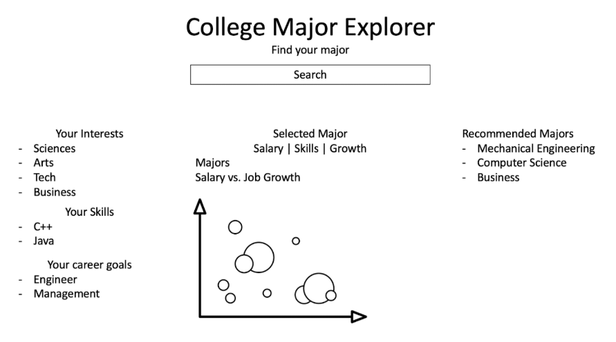

# Project Title: College Major Explorer

## Project Summary:
The College Major Explorer will be an application designed to guide students with making more informed decisions when choosing a college major. A common issue nowadays is students entering college uncertain about the field they decide to pursue.
Our app will aim to help them choose their paths by giving them a deep insight on detailed career options and salary projections based on majors that align with their interests. 

The app will use real datasets from U.S. Department of Education statistics, IPEDS, and Kaggle to display relevant information such as average salaries, required skills, job growth rates, and educational paths for each major. It will serve as a comprehensive tool for prospective students planning their academic careers by combining this data with an intuitive user interface and interactive visualizations.

## Description:
The main objective is to solve the common problem of uncertainty that many students face when selecting a major.  The College Major Explorer will help students discover academic majors that align with their personal interests, skills, and career goals. The application will allow users to select predefined interest areas, based on which it will give recommendations for college majors based on real world education and job data. Even though the application is mainly targeted towards high school students and undeclared college students, anyone considering a career switch will be able to benefit from it.

## Creative Component:
The College Major Explorer will include a responsive bubble chart using Chart.js plus the chartjs-plugin-zoom and PapaParse that plots each major as a bubble whose X axis = average salary, Y axis = projected job-growth rate, bubble size = number of graduates, and color = interest area, all with sliders to filter salary and growth thresholds, checkboxes to toggle interest categories, hover tooltips showing major name, salary, growth, and graduate count, and click-and-drag zooming to drill into clusters. This data visualization will be a great way for prospective college students to analyze majors, and the impact of their choice.

## Usefulness:
Choosing a college major is one of the most impactful decisions students make, yet often there is a lack of access to reliable information with real-world outcomes. Our app will fill that cap by allowing users to explore majors that align with their interests while also providing data-driven insights into potential careers, salary expectations, and skill requirements. Unlike generic quiz style major finders our tool will use real datasets and give users an insight on real data.

## Realness:
https://collegescorecard.ed.gov/data
The College Scorecard Open Data is a public dataset created by the U.S. Department of Education that tracks almost all colleges in the United States. This dataset includes CSV files, which include 1 row per school, and thousands of variables about the enrollment, costs, student aid, completion rates, and median earnings up to ten years after entry. Each yearly file has around 7,500 rows and 2,800 columns totaling to around 200k entries. It is updated every year and is in the public domain, which makes it a good source for our project.

https://www.kaggle.com/datasets/tunguz/college-majors
The College Majors dataset on Kaggle shows three years of American survey data in CSV tables to show how earnings and job outcomes vary by the undergraduate major choice. It includes the data about all ages, recent grads, and grad students, while also separating that data by their major. The college majors dataset is around 173 rows and 21 columns per category described above, making it a much smaller dataset. 

## Functionality:
Users of our platform will be able to explore and compare different majors that are aligned with their interests through the data that we provide. They can search for majors or filter by their preferences such as categories or growth rates or salary. A graph will then show the data information to the user. They can then save and compare different majors. 

  

## Task distribution:
It is hard to distribute work at this stage of the project since we don't know exactly what all the tasks will look like, however the broad idea is that we will all work on the back end together since that's the main purpose of the class. Antoni and Shrikar will work on front end, Shengwen will ensure that front and back end will work together and Artha will be responsible for finding data sets.
